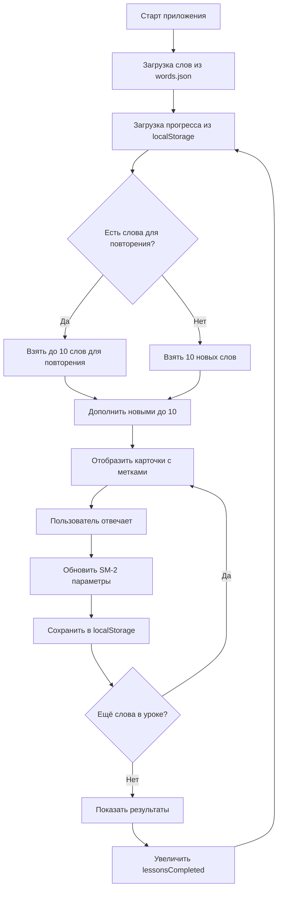
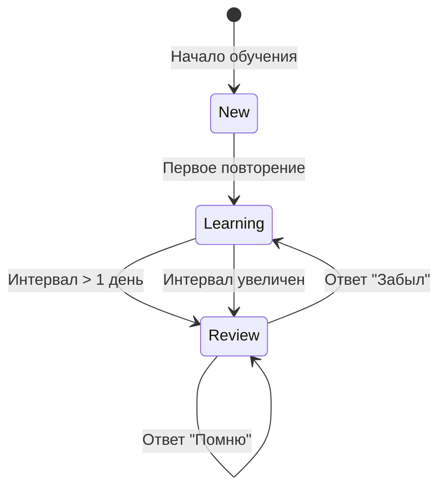

# План внедрения системы интервального повторения SM-2

## 1. Структура данных

### localStorage ключ: `wordsProgress`

```json
{
  "wordProgress": {
    "the": {
      "interval": 0,
      "repetitionCount": 0,
      "easFactor": 2.5,
      "lastReview": null,
      "nextReview": "2026-04-22T18:00:00.000Z",
      "status": "new"
    }
  },
  "totalReviews": 0,
  "lessonsCompleted": 0
}
```

**Поля:**
- `interval` — текущий интервал повторения в днях
- `repetitionCount` — количество успешных повторений
- `easFactor` — Easy Factor (начальное значение 2.5, уменьшается при ошибках, увеличивается при лёгких ответах)
- `lastReview` — дата последнего повторения (ISO строка)
- `nextReview` — дата следующего повторения
- `status` — `"new"` (новое), `"learning"` (в процессе), `"review"` (готово к повторению)

---

## 2. Алгоритм SM-2

### Формулы (основная логика в [`handleSM2Answer()`](script.js))

При ответе **"Помню"** (хорошо/легко):
```
repetitionCount++
if repetitionCount <= 1:
    interval = 1 день
elif repetitionCount == 2:
    interval = 2 дня
else:
    interval = floor(previous_interval * eas_factor)

if quality >= 3:
    eas_factor = eas_factor + (0.1 - (5 - quality) * (0.08 + (5 - quality) * 0.02))
```

При ответе **"Забыл"** (плохо):
```
repetitionCount = 0
interval = 1 день
eas_factor = eas_factor + (0.1 - (5 - quality) * 0.08)
```

### Mapping кнопок к quality (0-5):
| Кнопка | Quality | Описание |
|--------|---------|----------|
| "Забыл" | 0-2 | Слово не вспомнено |
| "Помню" | 3-5 | Вспомнено с усилиями/легко |

---

## 3. Выбор слов для урока

### Логика в [`initLesson()`](script.js:53)

```
1. Получить все слова из words.json
2. Загрузить прогресс из localStorage
3. Разделить слова на категории:
   - wordsDue: слова, у которых nextReview <= now
   - wordsNew: слова со status == "new"
4. ПРИОРИТЕТ: гарантировать минимум 1 новое слово в каждом уроке
5. Алгоритм выбора:
   a. Если wordsDue.length + wordsNew.length <= 10:
      - Урок = все dueWords + все newWords
   b. Если wordsDue.length + wordsNew.length > 10:
      - newWordCount = max(1, 10 - dueWords.length)  ← минимум 1 новое
      - dueWordCount = 10 - newWordCount
      - Урок = dueWords[0:dueWordCount] + newWords[0:newWordCount]
   c. Если wordsNew.length == 0 (все слова изучены):
      - Урок = dueWords[0:10]
6. Пометить слова в lessonWords с isDue/isNew флагами
```

---

## 4. Обновления UI

### 4.1 HTML (index.html)
- Добавить метку "Новое слово" на карточку
- Добавить статистику в header: "Готово к повторению: X", "Изучено: Y"
- Добавить кнопку "Пропустить повторение" (если есть слова для повторения)

### 4.2 CSS (styles.css)
- Стили для метки `.new-word-badge` (мелкий текст, серый цвет)
- Стили для метки `.due-word-badge` (может быть жёлтый/оранжевый)
- Обновить статистику

---

## 5. Файлы для изменения

| Файл | Изменения |
|------|-----------|
| [`script.js`](script.js) | Переписать `SpacedRepetition` класс |
| [`index.html`](index.html) | Добавить метки, статистику |
| [`styles.css`](styles.css) | Добавить стили для меток |

---

## 6. Диаграмма потока данных



---

## 7. Диаграмма состояний слова



---

## 8. Порядок реализации

1. **Структура данных** — создать методы `saveProgress()`, `loadProgress()`
2. **SM-2 алгоритм** — реализовать `calculateSM2()` метод
3. **Выбор слов** — переписать `initLesson()`
4. **Метки** — добавить HTML/CSS для "Новое слово"
5. **Статистика** — отобразить количество слов для повторения
6. **Тестирование** — проверить все сценарии
